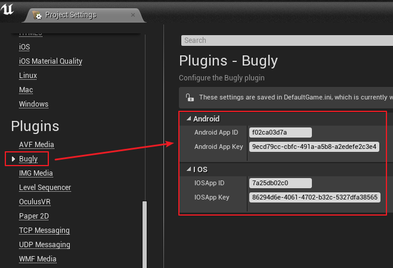
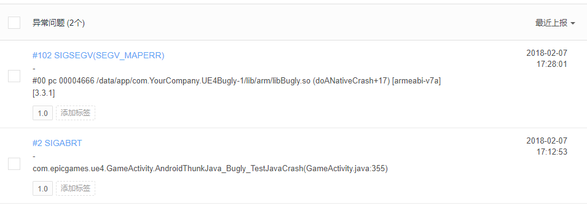
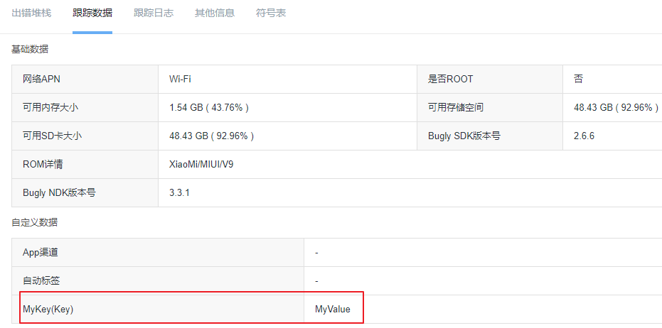
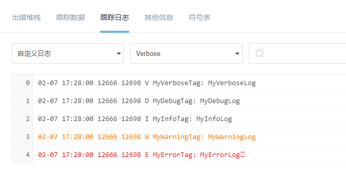
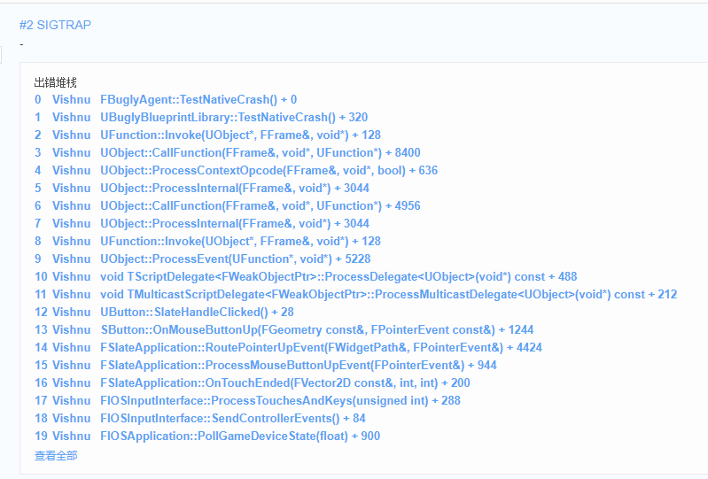

# Tencent Bugly For UE4 #

腾讯Bugly虚幻4插件

平台:

* Android 测试通过
* iOS 测试通过

TODO:

* 渠道、版本号和包名等信息设置接口
* Android上ANR异常收集不到
* iOS上自定义log收集不到

## 如何使用 ##

### 编译插件 ###

将 `Plugins\Bugly` 文件夹复制到自己工程的 `Plugins` 目录下，重新生成项目并编译

### 配置Bugly ###

首先去 [Bugly官网](https://bugly.qq.com/v2)，注册两个产品，一个 `Android`，一个 `iOS`

打开工程 `Edit/Project Settings/Plugins/Bugly` 菜单，分别将注册的两个产品的 `App ID` `App Key` 填到对应的输入框中

### 打包测试 ###

打包工程，在手机上运行游戏，可以参考 `Demo` 里，有三个崩溃测试菜单按钮，可以测试崩溃，目前 `ANR` 类型的异常收集不到，不知道为什么

Android 测试接口

* Java Crash
* Native Crash

iOS 测试接口

* Native Crash

### Bugly后台 ###

产生异常后就可以在后台页面查看，如图

* 崩溃列表

* 自定义数据

* 自定义Log

* iOS 崩溃堆栈

## 更新Bugly SDK ##

### 目前使用的版本 ###

* Android NDK: 3.3.1
* Android SDK: 2.6.6
* iOS SDK: 2.5.0

### 更新 Android SDK ###

#### 更新 NDK ####

到官网下载 `Android NDK` 包并解压，将 `libs` 目录中的内容覆盖到 `Plugins\Bugly\Source\BuglySDK\Android\libs` 中

#### 更新 SDK ####

到官网下载 `Android SDK` 包并解压，将 `bugly_crash_release.jar` 复制到 `Plugins\Bugly\Source\BuglySDK\Android\libs` 中

### 更新 iOS SDK ###

到官网下载 `iOS SDK` 包并解压，将 `Bugly.framework` 文件夹覆盖到 `UE4Bugly\Plugins\Bugly\Source\BuglySDK\iOS\Bugly.embeddedframework` 中

将 `UE4Bugly\Plugins\Bugly\Source\BuglySDK\iOS\Bugly.embeddedframework` 文件夹压缩为zip，覆盖 `UE4Bugly\Plugins\Bugly\Source\BuglySDK\iOS\Bugly.embeddedframework.zip`